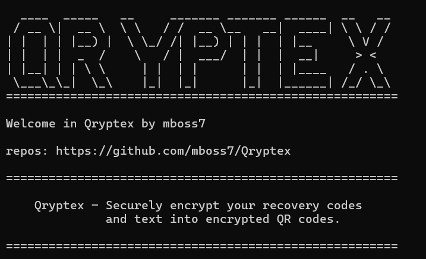

# Qryptex
Qryptex – Securely encrypt your recovery codes and text into encrypted QR codes.


# CLI APP

```shell 
# Clone repos: 
git clone https://github.com/mboss7/Qryptex.git

# Install dependencies:
pip install -r ./Qryptex/requirements.txt

# Test app: 
cd ./Qryptex/
pytest

# run CLI APP:
python ./Qryptex/src/qryptex/main.py
```



## FastAPI

To run Qrypotex API with CLI:
```shell
python main.py -a
```

To test it with powershell:
```powershell

irm "http://127.0.0.1:8000/crypt/?secret=v1&password=v2"
```
Or with bash:
```bash 
curl -s "http://127.0.0.1:8000/crypt/?secret=v1&password=v2"
```


# Python module 

## Installation 
```shell
pip install qryptex
```

## Import and object creation 
```python 
import qryptex 

qtx = qryptex.Qryptex()
```
## Functions 
```python
# Write encrypted QR : 
qtx.write_qr(<your_secret>, <your_password>)  

# Read encrypted QR : 
qtx.read_qr(<your_password>, <your_qr_path>)
```

# To test security good practices : 

Use docker, with temporary container (It a good practice for everything you test and you want to isolate) : 
```shell
    docker run --rm -it python:3.11-slim bash  # isolated python env in docker
	
	# or 
	
	docker run --rm -it ubuntu:latest bash   # isolated ubuntu env in docker 

```


# Feature in the roadmap : 

0) Security advises. 

1) Web API in order to do that every where you have an internet connection. 

2) Add TOTP and 2FA support. 

3) Docker support and container ready tu use.
